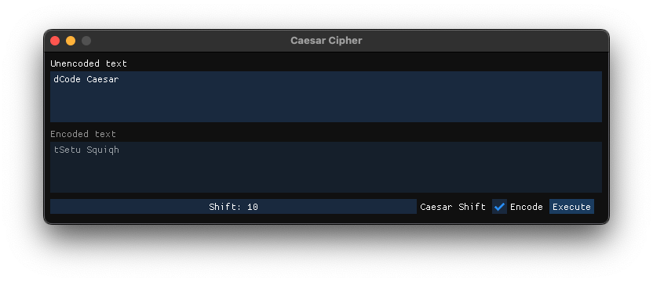

# Caesar Cipher

This is a small cli to tinker with the Caesar cipher.

Only supports ASCII alphabet (26 letters) upper and/or lower case.

# Build

```sh
$ mkdir build && cd build
$ cmake .. && cmake --build .
```

The binary output is `ccc`.

# Usage

```sh
ccc
	-s  shift value not greater than 26 (not mandatory with -g)
	-m  encode (e) or decode (d) (not mandatory with -g)
	-g  GUI only
	-h  shows the usage message
```

## Example:

Encoding with a shift value of 10:

```sh
$ ./ccc -s 10 -m e dCode Caesar

Original text = "dCode Caesar"
nMyno Mkockb
```

Decoding with a shift value of 10:

```sh
$ ./ccc -s 10 -m d nMyno Mkockb

Original text = "nMyno Mkockb"
dCode Caesar
```

GUI mode with [ImgUi][imgui]:



# LICENSE

[Modified BSD License][license].

You can find a copy of this license at [this static file][adolpw_license]

[adolpw_license]: https://adol.pw/licenses/modified_bsd_license.txt
[imgui]: https://github.com/ocornut/imgui
[license]: COPYING
